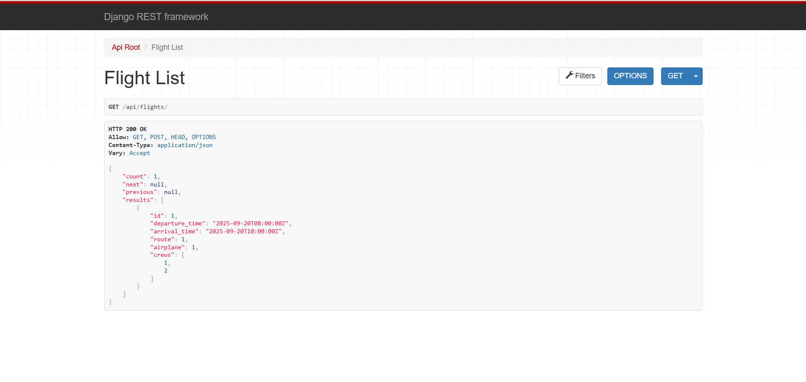

# Airport API

Django REST API for airport operations (routes, flights, airplanes, crews, tickets).
Built with DRF, JWT auth, filtering, pagination, and OpenAPI docs via drf-spectacular.

## Features
- CRUD for core entities (Airport, Route, AirplaneType, Airplane, Crew, Flight, Order, Ticket)
- Filtering, search, ordering, pagination
- JWT authentication (SimpleJWT)
- Browsable API + OpenAPI docs (Swagger/Redoc)
- Custom endpoints:
  - `GET /api/flights/{id}/seats/` — seat map
  - `POST /api/flights/{id}/book/` — book a seat (atomic, unique per flight)

## Screenshots

> All screenshots are taken from the Browsable API and docs (local run).

### Database schema


### Browsable API

*Browsable API root (`/api/`).*


*Airports list with pagination.*


*Airport detail page.*


*Flights list with filtering/ordering.*

### Custom endpoints

*GET `/api/flights/{id}/seats/` seat map.*

### API Docs & Admin

*Swagger UI (`/api/docs/`).*


*Redoc (`/api/redoc/`).*

## Requirements
- Python 3.12+
- pip, virtualenv
- (Optional) Docker for PostgreSQL

## Docker (PostgreSQL)

```bash
# start (build images and run containers)
docker compose up --build

# stop
docker compose down
```

## Setup (local, SQLite)
```bash

python -m venv .venv
. .venv/Scripts/activate  # Windows PowerShell
# source .venv/bin/activate  # macOS/Linux

pip install --upgrade pip
pip install -r requirements.txt

cp .env.example .env
# By default SQLite will be used (no extra steps needed)

python manage.py migrate
python manage.py createsuperuser
python manage.py loaddata fixtures/seed.json  # optional
python manage.py runserver